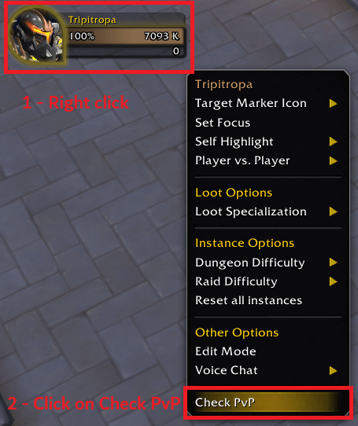
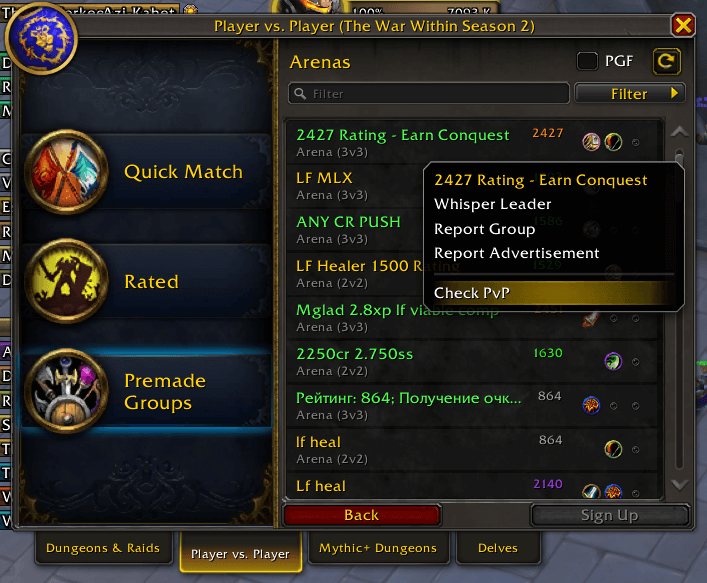

<div align="center">

# CheckPvPAssistant

</div>

<div align="center">

[](https://github.com/Kirom/CheckPvPAssistant/releases/latest)
[](https://github.com/Kirom/CheckPvPAssistant/actions)
[](https://www.curseforge.com/wow/addons/check-pvp-assistant)
[](https://addons.wago.io/addons/check-pvp-assistant)

[](https://worldofwarcraft.com)
[](https://github.com/Kirom/CheckPvPAssistant)
[](https://github.com/Kirom/CheckPvPAssistant/issues)

</div>

A World of Warcraft addon that adds convenient access to [Check-PvP.fr](https://check-pvp.fr) player profiles through right-click context menus. Supports LFG search results and applicants and generates full URLs for the player that is selected by default and can be copied to the clipboard immediately with Ctrl+C.

## Features

- **Right-click integration**: Access Check-PvP URLs directly from player context menus
- **Comprehensive coverage**: Works on LFG menu, targets, party members, raid members, guild members, friends, enemies, and yourself
- **LFG integration**: Generate URLs for players in LFG search results and applicants
- **Cross-realm support**: Properly handles players from different realms
- **Region detection**: Automatically detects your region (US, EU, KR, TW, CN)
- **Realm translation**: Converts internal realm names to Check-PvP.fr format

## Installation

### Manual Installation
1. Download the latest release
2. Extract the `CheckPvPAssistant` folder to your WoW AddOns directory:
   - **Windows**: `World of Warcraft\_retail_\Interface\AddOns\`
   - **Mac**: `Applications/World of Warcraft/_retail_/Interface/AddOns/`
3. Restart World of Warcraft or reload your UI (`/reload`)

### Automated Distribution Platforms

The addon is automatically distributed to multiple platforms via GitHub Actions:

- **CurseForge**: [Check-PvP Assistant on CurseForge](https://www.curseforge.com/wow/addons/check-pvp-assistant) *(Available)*
- **Wago**: [Check-PvP Assistant on Wago](https://addons.wago.io/addons/check-pvp-assistant) *(Available)*
- **WowUp**: Direct installation via GitHub releases *(Available)*
- **GitHub Releases**: [Latest releases](https://github.com/Kirom/CheckPvPAssistant/releases) *(Always available)*

### Direct Installation from Addon Managers (Recommended)

**CurseForge App:**
1. Open CurseForge app
2. Go to "Mods" → "World of Warcraft" → "Browse All"
3. Search for **"Check-PvP Assistant"**
4. Click "Install"

**WowUp:**
1. Open WowUp
2. Go to "Get Addons" tab
3. Search for **"Check-PvP Assistant"**
4. Click "Install"

**Wago:**
1. Open Wago
2. Go to "Addons" tab
3. Search for **"Check-PvP Assistant"**
4. Click "Install"

## Usage

1. **Right-click on any player** (target, party member, raid member, guild member, friend, enemy, or yourself)
2. Look for **"Check PvP"** in the context menu
3. **Click the option** to open a dialog with either the name-realm format or Check-PvP.fr URL (depending on your copy mode)
4. **Press Ctrl+C** to copy the text to your clipboard
5. **Press Enter or Escape** to close the dialog
6. If copying URLs: Open the URL in your browser to view the player's PvP statistics
7. If copying name-realm: Use the format for Discord, chat, or other applications

### Copy Modes

The addon supports two copy modes that can be switched using slash commands:

- **Name-Realm Mode** (default): Copies "PlayerName-RealmName" format for easy sharing in chat
- **URL Mode**: Copies full Check-PvP.fr URLs for direct browser access

Use `/checkpvp usename` or `/checkpvp useurl` to switch between modes.

> **Note**: If the website shows "character not found", don't worry! See the detailed step-by-step guide with screenshots in the [Character Not Found section](#character-not-found---step-by-step-fix) below to manually search for the character (this will fetch the latest data from Blizzard's servers).

## Screenshots & Examples

### Basic Usage Example

**Step 1: Right-click on your character**



*Right-click on your character to see the "Check PvP" option in the context menu*

**Step 2: Check PvP Dialog appears**

The dialog that appears depends on your current copy mode:

**Name-Realm Mode (default):**


*Dialog showing name-realm format ready to copy (Press Ctrl+C to copy)*

**URL Mode:**


*Dialog showing Check-PvP.fr URL ready to copy (Press Ctrl+C to copy)*

**Step 3: Using the copied content**

- **If in Name-Realm mode**: Use the "PlayerName-RealmName" format to paste into website search bar and open character profile
- **If in URL mode**: Open the URL in your browser to view character profile


*Example of Check-PvP.fr showing player's PvP statistics and profile*

### Character Not Found - Step by Step Fix
If the website shows "character not found", you can manually search for them (this will fetch the latest data on the website and make the profile appear):

**Step 1: Character Not Found Error**

*The error message when a character is not initially found*

**Step 2: Copy Character Information**

*Copy the character name and realm from the error message*

**Step 3: Manual Search**

*Paste the information into the search bar and search manually*

**Step 4: Character Found**

*The character profile after manual search (fetches latest data from Blizzard's servers)*

### Additional Player Sources
The addon works with players from various sources:

| Context | Screenshot |
|---------|------------|
| **LFG Creator** |  |
| **LFG Seeker** |  |
| **Guild Member** |  |
| **Community Member** |  |


### Known Issues

- Only EU, US, TW regions was tested, other regions need to be tested.

### Supported Contexts

The addon works in multiple contexts as demonstrated in the screenshots above:

- **Guild members** - Right-click in guild roster
- **Community members** - Right-click in community member list  
- **LFG creators** - Right-click on group leaders in LFG browser
- **LFG seekers** - Right-click on players looking for groups
- **Your own character** - Right-click on yourself
- **Target players** - Right-click on any targeted player
- **Party members** - Right-click in party frames
- **Raid members** - Right-click in raid frames
- **Friends list** - Right-click on friends
- **Battle.net friends** - Right-click on Battle.net friends
- **Enemy players** - Right-click on opposing faction players
- **In-chat players** - Right-click on any player in chat

## Requirements

- **World of Warcraft**: The War Within (11.0+) or later
- **Menu System**: Uses the new Menu API introduced in TWW

## Configuration

The addon has a simple debug mode that can be toggled using slash commands:

### Slash Commands

- `/checkpvp` or `/cpvp` - Show available commands
- `/checkpvp debug` - Toggle debug output
- `/checkpvp useurl` - Copy full Check-PvP URLs
- `/checkpvp usename` - Copy name-realm format (e.g., "PlayerName-RealmName") (default)
- `/checkpvp mode` - Show current copy mode

### Examples

```
/checkpvp debug        # Toggle debug mode
/checkpvp usename      # Copy name-realm format (default)
/checkpvp useurl       # Copy full URLs to Check-PvP.fr
/checkpvp mode         # Show current copy mode
```

Debug setting is automatically saved and will persist between game sessions.

## Technical Details

### Region Detection
The addon uses the same region detection method as RaiderIO, analyzing your character's GUID to determine the correct region for URL generation.

### Realm Name Translation
Realm names are automatically translated from WoW's internal format to Check-PvP.fr's expected format:
- Spaces are added where appropriate (`AeriePeak` → `Aerie Peak`)
- Special characters are handled (`Blade'sEdge` → `Blades Edge`)
- Capitalization is preserved

## Development

### Quick Start

```bash
# Test package locally
./scripts/package.sh

# Create a new release
./scripts/release.sh 1.0.1
```

### Automated CI/CD

The project uses GitHub Actions for:
- **Automated testing** on every push/PR
- **Multi-platform releases** to CurseForge, Wago, and WowUp
- **Version management** and changelog generation
- **Package validation** and integrity checking

### Project Structure
```
CheckPvPAssistant/
├── CheckPvPAssistant.toc           # Addon metadata and load order
├── .github/                        # GitHub Actions configuration
├── assets/                         # Images and screenshots
│   ├── images/                     # Image files
│   └── README.md                   # Image documentation
├── ReleaseNotes/                   # Release notes for each version
├── scripts/                        # Scripts for automated testing, release, and package validation
├── src/
│   ├── config.lua                  # Configuration management
│   ├── db/
│   │   ├── db_realms.lua          # Realm name translations (1000+ realms)
│   │   └── db_regions.lua         # Region ID mappings
│   ├── utils.lua                   # Debug utilities and helpers
│   ├── region.lua                  # Region detection logic
│   ├── url.lua                     # URL generation logic
│   ├── ui.lua                      # UI components and dialogs
│   ├── menu.lua                    # Menu system integration
│   ├── events.lua                  # Event handling coordination
│   ├── commands.lua                # Slash command handling
│   └── core.lua                    # Main initialization and coordination
├── CHANGELOG.md                    # Version history and changes
├── README.md                       # This file
├── LICENSE                         # License file
└── TODO.md                         # Future development plans

```

### Debug Mode
Enable debug output by using the slash command:
```
/checkpvp debug
```

This will show detailed information about:
- Region detection
- Realm translation
- Menu context data
- URL generation

## Contributing

1. Fork the repository
2. Create a feature branch (`git checkout -b feature/amazing-feature`)
3. Commit your changes (`git commit -m 'Add amazing feature'`)
4. Push to the branch (`git push origin feature/amazing-feature`)
5. Open a Pull Request

### Adding Screenshots

To help improve the documentation:

1. **Take screenshots** following the guidelines in [`assets/README.md`](./assets/README.md)
2. **Save images** to `assets/images/` directory
3. **Use descriptive filenames** (e.g., `context-menu-example.png`)
4. **Optimize file sizes** (keep under 500KB each)
5. **Update README** if adding new examples

See [`assets/README.md`](./assets/README.md) for detailed image requirements and guidelines.

## Changelog

See [CHANGELOG.md](CHANGELOG.md) for a detailed list of all changes and updates. 

## 💝 Acknowledgments

Special thanks to the Check-PvP.fr team for providing the excellent PvP statistics platform that makes this addon valuable to the WoW PvP community.

## 📞 Support & Feedback

For bug reports, feature requests, or general feedback:
- **GitHub Issues** - [CheckPvPAssistant Issues](https://github.com/Kirom/CheckPvPAssistant/issues)
- **Documentation** - See README.md for detailed usage instructions and screenshots

---

**Happy PvP hunting!** 🗡️⚔️