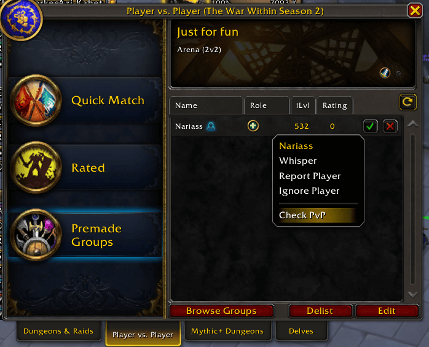
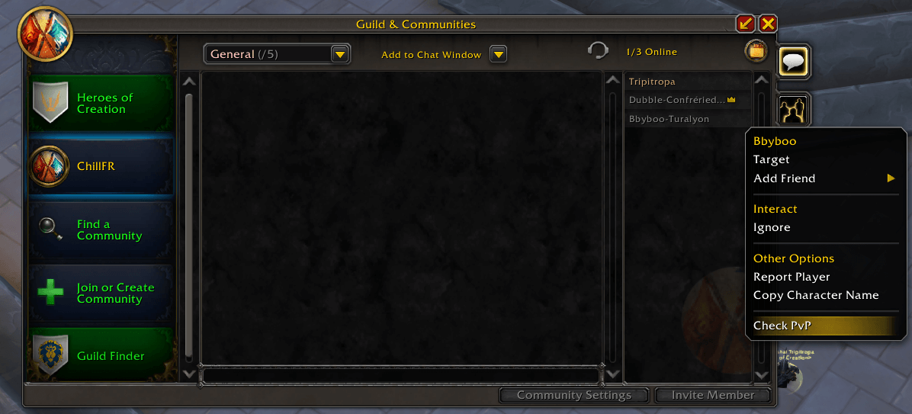

# CheckPvPAssistant

A World of Warcraft addon that adds convenient access to [Check-PvP.fr](https://check-pvp.fr) player profiles through right-click context menus. Supports LFG search results and applicants and generates full URLs for the player that is selected by default and can be copied to the clipboard immediately with Ctrl+C.

## Features

- **Right-click integration**: Access Check-PvP URLs directly from player context menus
- **Comprehensive coverage**: Works on targets, party members, raid members, guild members, friends, enemies, and yourself
- **LFG integration**: Generate URLs for players in LFG search results and applicants
- **Cross-realm support**: Properly handles players from different realms
- **Region detection**: Automatically detects your region (US, EU, KR, TW, CN)
- **Realm translation**: Converts internal realm names to Check-PvP.fr format

## Installation

### Manual Installation
1. Download the latest release
2. Extract the `CheckPvPAssistant` folder to your WoW AddOns directory:
   - **Windows**: `World of Warcraft\_retail_\Interface\AddOns\`
   - **Mac**: `Applications/World of Warcraft/_retail_/Interface/AddOns/`
3. Restart World of Warcraft or reload your UI (`/reload`)

### CurseForge/Wago/WowUp
*Coming soon*

## Usage

1. **Right-click on any player** (target, party member, raid member, guild member, friend, enemy, or yourself)
2. Look for **"Copy Check-PvP URL"** in the context menu
3. **Click the option** to open a dialog with the Check-PvP.fr URL
4. **Press Ctrl+C** to copy the URL to your clipboard
5. **Press Enter or Escape** to close the dialog
6. Open the URL in your browser to view the player's PvP statistics

> **Note**: If the website shows "character not found", don't worry! See the detailed step-by-step guide with screenshots in the [Character Not Found section](#character-not-found---step-by-step-fix) below to manually search for the character (this will fetch the latest data from Blizzard's servers).

## Screenshots & Examples

### Basic Usage Example

**Step 1: Right-click on your character**


*Right-click on your character to see the "Copy Check-PvP URL" option in the context menu*

**Step 2: URL Dialog appears**

*The dialog appears with the Check-PvP.fr URL ready to copy (Press Ctrl+C to copy)*

**Step 3: Successful Check-PvP.fr result**

*Open the URL in your browser to view the player's PvP statistics and profile*

### Character Not Found - Step by Step Fix
If the website shows "character not found", you can manually search for them (this will fetch the latest data on the website and make the profile appear):

**Step 1: Character Not Found Error**

*The error message when a character is not initially found*

**Step 2: Copy Character Information**

*Copy the character name and realm from the error message*

**Step 3: Manual Search**

*Paste the information into the search bar and search manually*

**Step 4: Character Found**

*The character profile after manual search (fetches latest data from Blizzard's servers)*

### Additional Player Sources
The addon works with players from various sources:

| Context | Screenshot |
|---------|------------|
| **LFG Creator** |  |
| **LFG Seeker** |  |
| **Guild Member** |  |
| **Community Member** |  |


### Known Issues

- Only EU, US, TW regions was tested, other regions need to be tested.

### Supported Contexts

The addon works in multiple contexts as demonstrated in the screenshots above:

- **Guild members** - Right-click in guild roster
- **Community members** - Right-click in community member list  
- **LFG creators** - Right-click on group leaders in LFG browser
- **LFG seekers** - Right-click on players looking for groups
- **Your own character** - Right-click on yourself
- **Target players** - Right-click on any targeted player
- **Party members** - Right-click in party frames
- **Raid members** - Right-click in raid frames
- **Friends list** - Right-click on friends
- **Battle.net friends** - Right-click on Battle.net friends
- **Enemy players** - Right-click on opposing faction players

## Requirements

- **World of Warcraft**: The War Within (11.0+) or later
- **Menu System**: Uses the new Menu API introduced in TWW

## Configuration

The addon has a simple debug mode that can be toggled using slash commands:

### Slash Commands

- `/checkpvp` or `/cpvp` - Show available commands
- `/checkpvp debug` - Toggle debug output

### Examples

```
/checkpvp debug        # Toggle debug mode
```

Debug setting is automatically saved and will persist between game sessions.

## Technical Details

### Region Detection
The addon uses the same region detection method as RaiderIO, analyzing your character's GUID to determine the correct region for URL generation.

### Realm Name Translation
Realm names are automatically translated from WoW's internal format to Check-PvP.fr's expected format:
- Spaces are added where appropriate (`AeriePeak` → `Aerie Peak`)
- Special characters are handled (`Blade'sEdge` → `Blades Edge`)
- Capitalization is preserved

## Development

### Project Structure
```
CheckPvPAssistant/
├── CheckPvPAssistant.toc           # Addon metadata and load order
├── assets/                         # Images and screenshots
│   ├── images/                     # Image files
│   └── README.md                   # Image documentation
├── src/
│   ├── config.lua                  # Configuration management
│   ├── db/
│   │   ├── db_realms.lua          # Realm name translations (1000+ realms)
│   │   └── db_regions.lua         # Region ID mappings
│   ├── utils.lua                   # Debug utilities and helpers
│   ├── region.lua                  # Region detection logic
│   ├── url.lua                     # URL generation logic
│   ├── ui.lua                      # UI components and dialogs
│   ├── menu.lua                    # Menu system integration
│   ├── events.lua                  # Event handling coordination
│   ├── commands.lua                # Slash command handling
│   └── core.lua                    # Main initialization and coordination
├── CHANGELOG.md                    # Version history and changes
├── README.md                       # This file
└── TODO.md                         # Future development plans
```

### Debug Mode
Enable debug output by using the slash command:
```
/checkpvp debug
```

This will show detailed information about:
- Region detection
- Realm translation
- Menu context data
- URL generation

## Contributing

1. Fork the repository
2. Create a feature branch (`git checkout -b feature/amazing-feature`)
3. Commit your changes (`git commit -m 'Add amazing feature'`)
4. Push to the branch (`git push origin feature/amazing-feature`)
5. Open a Pull Request

### Adding Screenshots

To help improve the documentation:

1. **Take screenshots** following the guidelines in [`assets/README.md`](./assets/README.md)
2. **Save images** to `assets/images/` directory
3. **Use descriptive filenames** (e.g., `context-menu-example.png`)
4. **Optimize file sizes** (keep under 500KB each)
5. **Update README** if adding new examples

See [`assets/README.md`](./assets/README.md) for detailed image requirements and guidelines.

## Support

- **Issues**: Report bugs or request features on [GitHub Issues](https://github.com/Kirom/CheckPvPAssistant/issues)
- **Discord**: TBA

## Changelog

See [CHANGELOG.md](CHANGELOG.md) for a detailed list of all changes and updates. 